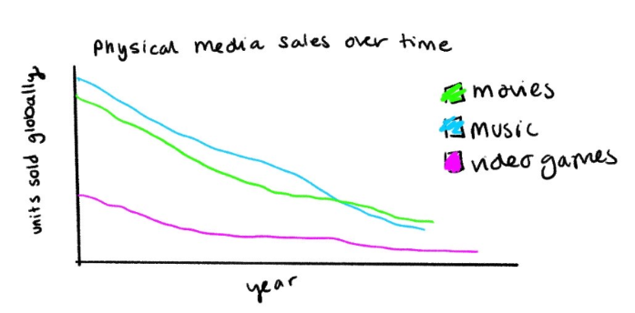
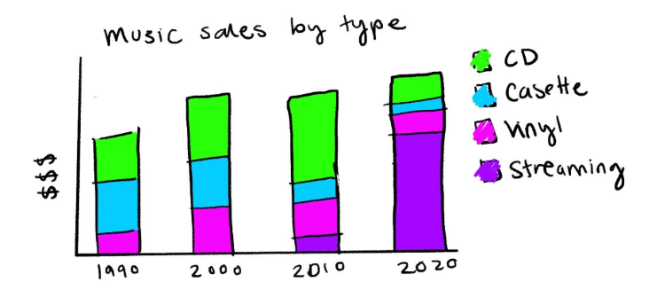
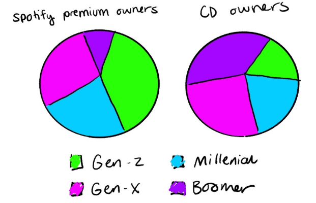

| [home page](https://cmustudent.github.io/tswd-portfolio-templates/) | [data viz examples](dataviz-examples) | [critique by design](critique-by-design) | [final project I](final-project-part-one) | [final project II](final-project-part-two) | [final project III](final-project-part-three) |

# Final Project Part 1: Outline
## Summary: Physical Media Ownership
The goal of this project is to investigate and understand trends in physical media over time. The central issue this report aims to address is the decline in physical media consumption. Across all categories (movies, music, video games, etc.) we have seen users shift from owning physical copies of content to subscriptions and streaming. The result of this is that we no longer truly “own” our entertainment. What happens when the site that was hosting media you paid for goes offline? What if your government bans content and removes it from the internet? How much media is being lost to time because no one is making it available on modern platforms and websites? This project will illustrate the decline in physical media ownership using data visualizations and will hopefully convince you to physically buy the things you like.

## Structure
### 1. Physical/digital purchase rates over time
Introduce rise in streaming and decline in physical ownership
Include data across multiple industries for wide breadth
### 2. Purchases by age/region
Show which demographics are engaging with physical media more
Develop connection with reader
### 3. Cost of media over time
Comparison between cost of hardware (TVs, CD players, game consoles, etc.) versus the media itself
Adjusting for inflation: are these things really that expensive?
### 4. Conclusion
Reader will be able to see how physical ownership is declining, who is most/least responsible for this, and how the costs of digital/physical differ. This will allow them to make an informed decision to *hopefully* purchase physical!

# Sketches
### Cohesive color palette

I want to use bright, saturated colors for this presentation. I will select a set similar to this one, but with testing to ensure there is sufficient contrast for people with visual impairments such as colorblindness.

### Purchases over time
Initial visualization summarizing sales for multiple genres

More specific graph(s) for breakdowns by type to allow for physical vs digital comparison

### Purchases by group
Other visualizations that convey demographic information. Maybe a map showing different regions of the world?

### Cost of media over time
No sketch for this one since I'm unsure what the data will look like, but this will be very helpful for convincing people that physical media is worth buying

# Data
### Planned information
For this project I want data that captures trends across multiple genres of media, long periods of time, and different demographics. Some industries have much better documentation for this information, so I am anticipating not being able to get everything for every single one. My hope is that by focusing on three groups (movies, music, video games) I can find data in at least one of them that is useful for the project.
I found a variety of datasets on Kaggle which is always appreciated. I also found many reports on trends that were in PDFs. This is not ideal, but I anticipate transcribing information from some of these documents. 
### Manipulation
I may attempt to adjust some data for inflation over time to more accurately track whether things have become more or less expensive. I will also see if I can join any sets together to allow for further analysis, but am unsure if this will be possible. I hope at a minimum that I can graph multiple sources of data together if they are all showing something over time.
### Working list of sources
Many more to come!

[Gregorut. (2017). Video game sales. Kaggle.](https://www.kaggle.com/datasets/gregorut/videogamesales)

[The Devastator. (2023). U.S. recorded music revenue by format. Kaggle.](https://www.kaggle.com/datasets/thedevastator/us-recorded-music-revenue-by-format)

[Ajayakumar, M. (2023). Spotify user behavior dataset. Kaggle.](https://www.kaggle.com/datasets/meeraajayakumar/spotify-user-behavior-dataset)

[Hussain, T. (2023). Best-selling game consoles of all time. Kaggle.](https://www.kaggle.com/datasets/tayyarhussain/best-selling-game-consoles-of-all-time)

# Method & Medium
I intend to use both Shorthand and Tableau for this project so that I can get more experience with them. I will also put all of my visualizations onto my Github site. At this moment I have no other planned tools. I may mess with the CSS for Github so the styling matches my project theme, but this is not necessary.

# AI Acknowledgement
I used ChatGPT to assist with my initial search for publically accessible data.
